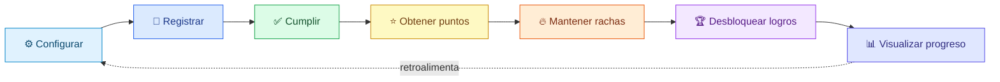
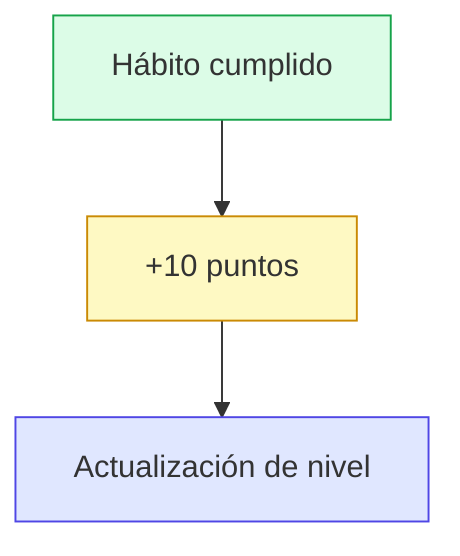
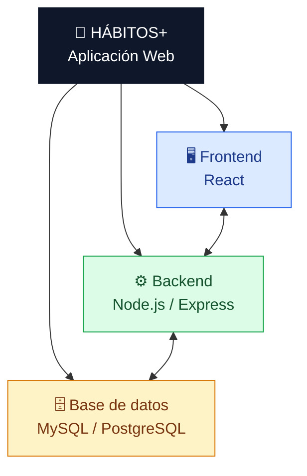
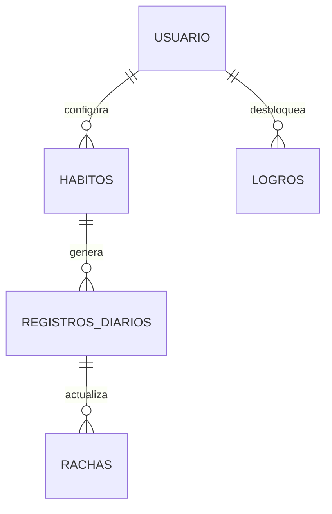

<div align="center">

# 🌱 HÁBITOS+

### Dashboard Gamificado de Hábitos Saludables

**Convierte tus hábitos diarios en progreso visible.**

[](#-tecnologías)
[](#-tecnologías)
[](#-tecnologías)
[](#-tecnologías)
[](#-autenticación)

[](#)
[](#)
[](#)

</div>

<br>

<p align="center">
  
  
  
  
</p>

---

## 📖 Tabla de contenido

- [📌 Descripción del proyecto](#-descripción-del-proyecto)
- [🎯 Objetivos](#-objetivos)
- [✨ Funcionalidades principales](#-funcionalidades-principales)
- [🧩 Arquitectura funcional](#-arquitectura-funcional)
- [🗄️ Modelo de datos](#️-modelo-de-datos)
- [🛠️ Tecnologías](#️-tecnologías)

---

## 📌 Descripción del proyecto

En la vida universitaria y laboral, mantener hábitos como dormir adecuadamente, estudiar, hacer ejercicio, hidratarse o leer puede resultar difícil debido a las múltiples responsabilidades diarias.

**HÁBITOS+** propone una solución mediante un ciclo sencillo:

<div align="center">



</div>

El sistema permite que cada usuario configure sus propios hábitos y registre diariamente su cumplimiento. La información se transforma en indicadores visuales que permiten comprender la evolución y mantener la motivación.

---

## 🎯 Objetivos

### Objetivo general

> Desarrollar una aplicación web que permita a los usuarios registrar, monitorear y visualizar el cumplimiento de sus hábitos saludables diarios, incorporando mecanismos de gamificación que incentiven la constancia y el compromiso personal.

### Objetivos específicos

| # | Objetivo |
|---|----------|
| 1 | Diseñar un modelo de datos simple y escalable |
| 2 | Permitir el registro y seguimiento diario de hábitos |
| 3 | Implementar un sistema de puntos |
| 4 | Calcular y visualizar rachas de cumplimiento |
| 5 | Crear un catálogo de logros desbloqueables |
| 6 | Mostrar el progreso mediante gráficas |
| 7 | Implementar un mapa de calor tipo calendario |
| 8 | Mostrar puntos, nivel y racha activa |
| 9 | Facilitar el registro de hábitos mediante una interfaz sencilla |
| 10 | Mantener una experiencia responsive para diferentes dispositivos |

---

## ✨ Funcionalidades principales

### 🔐 Autenticación

El usuario podrá crear una cuenta, iniciar sesión y acceder de forma segura a su información mediante **rutas protegidas** y **sesión persistente con JWT**.

- ✅ Validación de campos
- ✅ Manejo de errores
- ✅ Protección de la información del usuario

<br>

### 📝 Configuración de hábitos

<table>
<tr>
<td width="50%" valign="top">

**Hábitos predefinidos**

| Ícono | Hábito |
|:---:|---|
| 😴 | Dormir |
| 📚 | Estudiar |
| 🏃 | Hacer ejercicio |
| 💧 | Tomar agua |
| 📖 | Leer |

</td>
<td width="50%" valign="top">

**Hábito personalizado**

- Nombre
- Meta
- Frecuencia:
  - Diaria
  - Días específicos de la semana

</td>
</tr>
</table>

<br>

### ✅ Checklist diaria

Cada día el usuario consulta sus hábitos programados y registra su cumplimiento, sin recargar la página y manteniendo historial completo.

```
☑ Dormir 8 horas
☑ Estudiar 2 horas
☐ Hacer ejercicio
☑ Tomar agua
```

<br>

### 🎮 Sistema de gamificación

<table>
<tr>
<td width="50%" valign="top">

#### ⭐ Puntos

Cada hábito cumplido genera puntos, más bonificaciones al alcanzar hitos de racha.



</td>
<td width="50%" valign="top">

#### 🔥 Rachas

La constancia se mide en días consecutivos de cumplimiento.

| Día | Racha |
|:---:|:---:|
| 1 | 🔥 1 día |
| 3 | 🔥 3 días |
| 5 | 🔥 5 días |
| 7 | 🏆 7 días |

Se guarda **racha actual** y **racha máxima histórica**.

</td>
</tr>
</table>

<br>

#### 🏆 Logros e insignias

Se desbloquean automáticamente al alcanzar objetivos, y se muestran en el perfil como vitrina de logros:

- 🏅 Semana completa
- 🏃 30 días consecutivos de ejercicio
- 😴 Buen descanso durante 10 días consecutivos

<br>

### 📊 Dashboard

El centro de la experiencia de HÁBITOS+:

| Componente | Descripción |
|---|---|
| 📈 **Progreso semanal / mensual** | Alterna entre períodos para analizar la evolución |
| 🗓️ **Mapa de calor** | Calendario visual estilo contribuciones de GitHub |
| ⭐ **Puntos y nivel** | Puntos acumulados y nivel actual del usuario |
| 🔥 **Racha activa** | Destaca la racha activa más larga |

<br>

### 🎉 Retroalimentación inmediata

<div align="center">

```
🎉 +10 puntos
🔥 Racha de 6 días

🏆 ¡Nuevo logro desbloqueado!
```

</div>

---

## 🧩 Arquitectura funcional



---

## 🗄️ Modelo de datos

| Tabla | Propósito |
|---|---|
| `usuarios` | Información de las personas registradas |
| `habitos` | Hábitos configurados por cada usuario |
| `registros_diarios` | Cumplimiento diario de cada hábito |
| `rachas` | Control de rachas actuales y máximas |
| `logros` | Logros desbloqueados por cada usuario |

### Relaciones principales



---

## 🛠️ Tecnologías

<div align="center">

| Capa | Tecnologías |
|---|---|
| **Frontend** | React · Recharts / Chart.js · HTML5 · CSS3 · JavaScript |
| **Backend** | Node.js · Express |
| **Base de datos** | PostgreSQL |
| **Autenticación** | JSON Web Tokens (JWT) · Manejo de sesiones |

</div>

> 💡 La especificación original contempla React para el frontend, Node.js con Express (o PHP) para el backend, y MySQL o PostgreSQL para la base de datos.

---

<div align="center">

**Hecho con 🔥 constancia y ⭐ puntos por convertir hábitos en progreso visible.**

</div>
